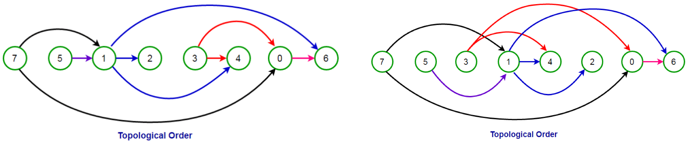
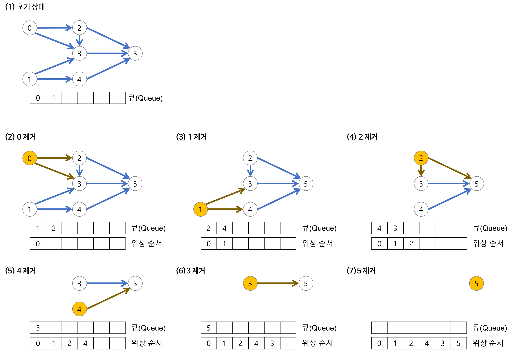

# 위상정렬(Topological Sort)

---

## 위상정렬이란

"어떤 일을 하는 순서를 찾는 알고리즘"

방향 그래프에 존재하는 각 정점들의 선행 순서를 위배하지 않으면서 모든 정점을 나열하는 것 

## 위상정렬의 특징

* 하나의 방향 그래프에는 여러 위상 정렬이 가능
* 위상 정렬의 과정에서 선택되는 정점의 순서를 위상 순서(Topological Order)라 한다.
* 위상 정렬의 과정에서 그래프에 남아 있는 정점 중에 진입 차수가 0인 정점이 없다면, 위상 정렬 알고리즘은 중단되고 이러한 그래프로 표현된 문제는 실행이 불가능한 문제가 된다.

## 위상정렬을 이용한 기본적인 해결 방법

1. 진입 차수가 0인 정점(들어오는 간선의 수가 0)을 선택
   * 진입 차수가 0인 정점이 여러 개 존재할 경우 어느 정점을 선택해도 무방
   * 초기에 간선의 수가 0인 정점을 모두 큐에 삽입
2. 선택된 정점과 엮여 있는 모든 간선을 삭제
   * 선택된 정점을 큐에서 삭제
   * 선택된 정점에 부속된 모든 간선에 대한 간선의 수를 감소
3. 위의 과정을 반복해 모든 정점이 선택, 삭제되면 알고리즘을 종료

## 도움을 준 사이트

* https://gmlwjd9405.github.io/2018/08/27/algorithm-topological-sort.html

